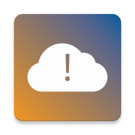

# Cloudzy

<b>Cloudzy</b> is a free and open-source app that gets you the latest alerts for major cloud providers and displays them in an easy-to-read manner. We provide tailored notifications for the cloud providers you care about the most.  Our alerts drill down to the specific areas which are crucial to keep you up to date with the latest developments such as “most recent updates” and “affected products”.  This is an offline-first app so even without a network connection you can see any updates that are cached on your device.  This app is developed by two Android developers with a passion for technology and cloud infrastructure.   If you have any suggestions or would like to report an issue then please reach out to us by either making an issue on our Github repository or by using one of the provided methods at our Google Play Store page.

## Features

* Dark Mode
* Tailored Notifications that can be customized
* Support for Amazon Web Services and Google Cloud Provider already available, Azure coming soon.
* Intuitive UI

## Tech Stack For Nerds

* MVVM architecture
* WorkManager
* Dagger-Hilt
* Material Design all the way
* Architecture and Navigation Components
* Single-Activity pattern.
* Retrofit and Room Database
